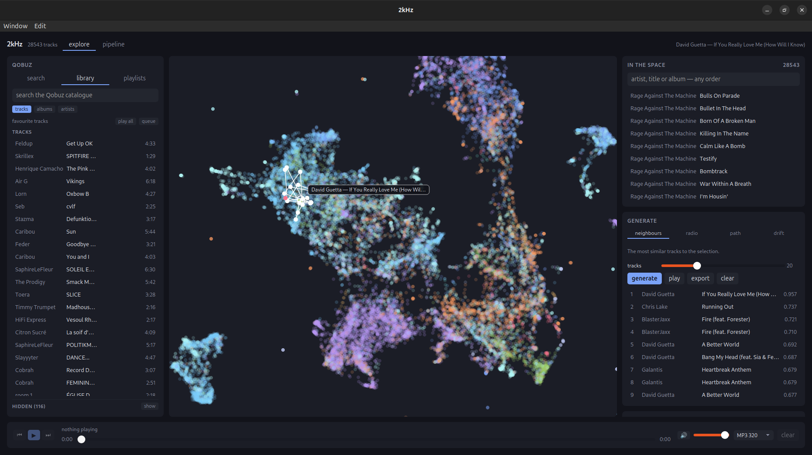

# 2kHz

Music as a navigable space. Every track becomes a point in ~80 dimensions where
distance approximates perceptual similarity, so recommendation becomes geometry:
the nearest neighbours of a track, a path that morphs from A to B, or a drift in
a direction you describe in words.

Qobuz's API returns metadata only (no BPM, no key, no energy), so the acoustic
half of every vector is computed from the audio itself.



The library on the left, the space in the middle, a UMAP projection of 28,543
tracks, with the selection's nearest neighbours drawn over it, and on the
right, what that selection generated.

## Shape of the system

```
  Python: analysis + layout                Rust: crawler + desktop app
  ─────────────────────────                ───────────────────────────
                                           favourites ─┐
              catalog ◄──────────────────              ├─► crawl ──► catalog
                 │                         similar   ──┘
                 ▼                                        rusqlite + memmap
         fetch 90s excerpt                                neighbours/paths/drift
                 │                                        ort: CLAP text tower
          [LRU cache, capped]                             library browse, search,
                 ▼                                        playback, playlists
   Essentia + CLAP extraction                                     │
                 │                                                │ binary over
                 ▼                                                │ custom protocol
       assemble space ──────────────►  data/two_khz.db           ▼
                 │                     data/space.bin      webview: canvas map,
                 ▼                     data/space.json     controls, <audio>
         UMAP 2D layout ────────────►  layout
```

Python does the modelling (Essentia, CLAP, UMAP). Rust does I/O and interaction.
The two meet at files rather than a socket: both read and write `two_khz.db`,
and Python writes the vector file that Rust memory-maps. The schema is
`schema.sql` at the repo root, executed by both halves, so they cannot drift.

Design notes, measurements and the space layout are in
[docs/design.md](docs/design.md).

## Setup

Requires `ffmpeg`, `uv`, and a Rust toolchain.

```sh
cd pipeline
uv sync --extra extract --extra layout
```

The app draws into a system webview, so on Linux it also wants GTK and webkit
headers at build time, without them the build stops at `glib-sys` with
`glib-2.0 was not found in the pkg-config search path`. `libwebkit2gtk-4.1` is
what wry links against; `libxdo` and the appindicator arrive via tao and
tray-icon:

```sh
sudo apt install build-essential pkg-config libwebkit2gtk-4.1-dev \
  libgtk-3-dev libsoup-3.0-dev libxdo-dev libayatana-appindicator3-dev \
  librsvg2-dev libssl-dev
```

The headless half needs none of it: the server and the crawler build with
`--no-default-features --features local`, which keeps dioxus, wry and GTK out.

### Credentials

Qobuz does not issue API credentials to individuals, and since April 2026 its
API no longer serves anonymous requests, so sign-in has to happen in a browser:

```sh
cd pipeline
uv run two-khz login
```

That scrapes the current app id and signing secrets from the web player, opens
your browser to Qobuz, and writes all three into `.env`.

If the browser round-trip is awkward, log in at <https://play.qobuz.com/>, open
devtools → Application → Local Storage → `play.qobuz.com`, copy the
`localuser.token` value, and set:

```sh
QOBUZ_USER_AUTH_TOKEN=<the token>
```

Tokens expire when the session ends. The app id and secrets rotate with web
player releases; `two-khz refresh-credentials --write` re-scrapes those alone.

## Running the pipeline

```sh
cd app     && cargo run --release --bin crawl -- --max-tracks 2000
cd pipeline
uv run two-khz whoami                       # verify credentials
uv run two-khz analyse                      # download excerpts, extract features
uv run two-khz build-space                  # assemble vectors
uv run two-khz layout                       # UMAP projection for the map
uv run two-khz evaluate                     # space sanity check
```

Every stage is resumable: the crawl frontier lives in SQLite and analysis skips
what it has already done, so Ctrl-C and rerun is always safe.

For text steering, export the CLAP text tower once, 479MB, lands in
`data/models/`:

```sh
uv run python -m two_khz.features.onnx_export
```

### Crawling

Seeds from your favourites, then expands outward through
`artist/getSimilarArtists`.

```sh
cd app
cargo run --release --bin crawl -- --max-tracks 5000   # favourites, then similar
cargo run --release --bin crawl -- --no-seed           # resume the frontier only
cargo run --release --bin crawl -- --artist 43840      # one discography, queued
cargo run --release --bin crawl -- --album 0634904077969
```

Requests are limited to 2/s with retry-and-backoff on 429s, one account pays
for every call. `uv run two-khz crawl` still exists and writes the same tables.

The app can crawl while you use it, from the **Pipeline** view. Both halves
share the one rate limit, so browsing during a crawl is slower, not blocked.

## Running the app

```sh
cd app
cargo run --release
```

Two views, switched from the header, over a transport bar that stays put.

**Explore** is three columns: Qobuz live on the left, the map in the middle, the
analysed space on the right. Clicking a track plays it and makes the list you
clicked in the queue. **in space** selects an analysed track on the map;
**fetch** pulls an album's tracklist, or an artist's discography, into the
catalogue.

Generation is one panel with four modes:

| mode | what it does |
|---|---|
| neighbours | the *k* most similar tracks; follows the selection as you browse |
| radio | a greedy walk, each jump to the nearest track not yet played |
| path | A to B, either the shortest route or an evenly paced interpolation |
| drift | away from the selection, towards a phrase |

Radio has an *artist pull* slider, which stops a walk sitting inside one
discography. Map positions are fixed until `layout` is re-run, the weight
sliders change which tracks are near each other, not where the dots sit.

**Pipeline** runs the same four stages as the CLI and streams their output into
a log. Stop signals the stage's whole process group, and closing the app does
the same, so a locally started stage never outlives the window.

**Playback** offers MP3 320, FLAC 16/44 or FLAC hi-res. It needs credentials;
browsing the space does not.

To try the app without a real corpus:

```sh
cd pipeline && uv run python scripts/make_demo.py /tmp/two-khz-demo
cd ../app && TWO_KHZ_DATA_DIR=/tmp/two-khz-demo/data cargo run
```

## Hiding an artist

`blocked_artists` is a table both halves honour: the pipeline will not crawl
them, follow them to their similar artists, analyse their tracks or place them
in the space, and the app hides what is already stored and refuses to play it.

```sh
uv run two-khz block "artist name"       # or an artist id
uv run two-khz block 224109 --reason "why"
uv run two-khz blocked                   # list
uv run two-khz unblock 224109
```

Or click **hide** on any artist or track in the app. The **Hidden** panel at the
bottom of the Qobuz column lists them with a way back.

Hiding filters rather than deletes, which is what lets a block take effect
immediately and be undone. `block --purge` deletes the tracks, features and
albums instead; re-run `build-space` and `layout` afterwards.

The match is on `artists.id`, so a featured credit that Qobuz files under a
different artist id can still surface, block those ids too. An ambiguous name
refuses to act rather than guessing.

## Running it on more than one machine

One machine needs nothing here: `cargo run` in `app/` and everything is in
process. The server exists so a device that *cannot* host the pipeline, a
phone, mainly, can still use the space.

```
  Server (x86_64, the pipeline's machine)     Client (desktop / Android)
  ───────────────────────────────────────     ──────────────────────────
  Qobuz credentials  ──┐                      syncs ~44MB and navigates it
  ONE 2/s rate limit ──┤                      neighbours · radio · path · drift
  pipeline stages    ──┤                        → local, live sliders, offline
  479MB CLAP tower   ──┘                      plays the signed URL directly
         │                                             ▲
         │  /api/… + SSE for stage output              │ stream URL
         └──────── audio never proxies ────────────────┘
```

The space is synced, not queried: a neighbour lookup is microseconds, so routing
a weight slider through a socket would cost the one property the space was built
for. Only `embed` crosses the wire. Clients get `catalog.db`, a projection of the
corpus down to what navigation reads, **269MB → 39MB**.

```sh
cd server
cargo run --release -- pair --name desktop --scope pipeline   # prints a token, once
cargo run --release -- build-catalog                          # the slim copy
cargo run --release -- serve                                  # 127.0.0.1:7700
```

Then point a client at it:

```sh
TWO_KHZ_SERVER=http://host:7700 TWO_KHZ_TOKEN=<token> cargo run
```

Two scopes, both authenticated: `play` is browsing, syncing and minting a stream
URL; `pipeline` is crawling and analysis. Each device gets its own token, stored
only as a SHA-256 hash, so one phone can be revoked without re-pairing the rest.

This speaks plain HTTP and binds to loopback. Anything beyond loopback belongs
behind WireGuard/Tailscale or a TLS proxy.

A stage started from a client **outlives that client**, so **stop** is the only
thing that ends one early.

## Docker

The server half ships as an image, so the machine that hosts the pipeline does
not need a Rust toolchain or a `uv` of its own.

```sh
docker run -d --init --name two-khz -p 127.0.0.1:7700:7700 \
  -v two-khz-data:/data --env-file .env 4gjr3z1t/2khz:v0.6.1

docker exec two-khz two-khz-server pair --name phone --scope play
```

[`compose.yaml`](compose.yaml) is the worked version, pairing, the slim
catalogue, the volumes and the loopback-only port mapping.

Two targets, because the analysis stack is not small:

| image | what it carries | size |
|---|---|---|
| `4gjr3z1t/2khz:v0.6.1` | the API, the Rust crawler, `embed` | 266MB on disk, 70MB to pull |
| `ghcr.io/nab-os/two-khz-server:v0.6.1-pipeline` | the above plus uv, ffmpeg and the Python stages | 3.8GB to pull, torch and essentia-tensorflow |

Both carry moving tags too, `:latest` and `:pipeline`, but everything here
pins a version, so that pulling never silently changes the server underneath a
corpus that took hours to build.

The slim one is on both Docker Hub and GHCR; the pipeline one is GHCR-only,
being several GB. Starting a **Python** stage on the slim image fails with
`could not start uv`; crawling, syncing, browsing and text steering all work,
because those are Rust. Reach for the pipeline image on the machine that
actually analyses, and keep in mind it is x86_64-only,
`essentia-tensorflow` publishes exactly one wheel, cp312 manylinux x86_64.

Both are built by CI from the [`Dockerfile`](Dockerfile)'s two targets, so
`docker build --target server .` reproduces the published image when you need
to run uncommitted changes.

The container binds `0.0.0.0` and publishes to `127.0.0.1`, which keeps the
loopback property the rest of this section describes: the bind has to be
`0.0.0.0` to be reachable across the container boundary at all, so it is the
*published* port that is restricted.

Three things about the image are load-bearing rather than arbitrary, and are
commented where they occur in the [`Dockerfile`](Dockerfile):

- **`/app`.** `repo_root()` is `CARGO_MANIFEST_DIR` resolved at compile time
  and Python takes `REPO_ROOT` from its own `__file__`, so the build path and
  the run path must be the same one.
- **`/app/data` is a symlink to `/data`.** Rust honours `TWO_KHZ_MODEL_DIR`,
  but `features/models.py` hardcodes `REPO_ROOT/data/models`. The symlink is
  what stops the 479MB CLAP tower being stored twice.
- **`UV_NO_SYNC=1`.** Everything is installed at build time; without it every
  stage start would try to re-sync and fail whenever the index is unreachable.

Credentials never enter the image, `.env` is in `.dockerignore`, and the
corpus, the space and the device tokens all live in the `/data` volume, which
is the only thing here worth a backup.

## Android

Remote-only by construction: there is no Essentia on a phone, no `uv` to spawn,
and no repo checkout to find a `.env` in.

```sh
cd app
. ./android-env.sh                 # ANDROID_HOME / NDK / per-API clang wrappers
dx build --release --platform android --target aarch64-linux-android \
   --no-default-features --features mobile

adb install -r target/dx/two-khz-app/release/android/app/app/build/outputs/apk/debug/app-debug.apk
```

`--target` matters: without it `dx` builds x86_64 for an emulator, which will
not install on a phone. **arm64 only**, `manganis`, the asset crate dioxus
pulls in, refuses to build for 32-bit Android.

Pairing happens on a setup screen rather than through environment variables, and
is stored in `server.json` beside the synced space.

Use `dx`, not `cargo android build`, the two generate conflicting JNI
trampolines. `gen/`, `mobile.toml` and the `[package.metadata.cargo-android]`
block are leftovers from `cargo mobile init` and are unused.

## Packages

`.github/workflows/build.yml` builds on every push to `main`, on `v*` tags, and
on demand. A tag additionally opens a GitHub release with everything attached.

| target | artifacts |
|---|---|
| Ubuntu 24.04 | `.deb`, `.AppImage`, `.tar.gz`, desktop and server separately |
| Ubuntu 26.04 | the same, built on 26.04 |
| Android | one signed arm64 `.apk` |
| Docker | `4gjr3z1t/2khz` and `ghcr.io/…/two-khz-server`, plus `:pipeline` on GHCR alone |

Each Ubuntu release builds on its own runner, and the desktop and server
packages are separate, see [docs/design.md](docs/design.md#packaging).

The image is built on every push so a broken `Dockerfile` fails next to the
`.deb`s, but only pushed from a tag. It needs `DOCKERHUB_USERNAME` and
`DOCKERHUB_TOKEN` as repository secrets; the GHCR half uses `GITHUB_TOKEN` and
needs nothing. The `pipeline` image goes to GHCR only, several GB, and no
pull limit there.

The Android job signs when it can read the keystore secrets and falls back to
an unsigned `…_arm64-unsigned.apk` when it cannot, rather than being skipped.
That fallback is there for pull requests from forks, which structurally cannot
read a secret: arm64 still gets compiled, it just produces a file `adb install`
will refuse. A **tag fails instead** of falling back, so a release can never
carry an APK nobody can install.

### Signing the APK

One keystore, generated once and kept forever:

```sh
keytool -genkeypair -v -keystore two-khz.jks -alias two-khz \
  -keyalg RSA -keysize 4096 -validity 10000
```

`keytool` asks for a password and for the name/organisation fields that end up
in the certificate; only the password matters to CI. Then hand the four values
to GitHub, `gh secret set` reads the value from stdin, so none of them reach
your shell history:

```sh
base64 -w0 two-khz.jks | gh secret set ANDROID_KEYSTORE_BASE64
gh secret set ANDROID_KEYSTORE_PASSWORD     # paste the password, then Ctrl-D
gh secret set ANDROID_KEY_PASSWORD          # same one, unless you set a separate key password
printf two-khz | gh secret set ANDROID_KEY_ALIAS
```

`ANDROID_KEY_PASSWORD` is optional, the workflow falls back to the store
password when it is unset, which is what a keystore made with the command above
wants.

**Keep the `.jks`, outside the repo and backed up.** Android identifies an app
by its signing key: lose it and no existing install can ever be upgraded, only
uninstalled and replaced. The key this repository's releases are signed with
lives in `~/.config/two-khz/` and is `CN=2kHz, O=nab-os, C=FR`, SHA-256
`A0:9C:6C:ED:4E:4B:4B:AC:9F:F9:A4:61:39:87:A8:10:AC:F0:74:C1:0F:75:D9:D0:0A:03:B6:46:49:E3:93:1C`,
worth recording, since that fingerprint is what a phone compares an upgrade
against.
